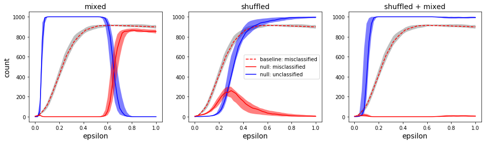

# null_class_adversarial_defense
Code to replicate the arxiv technical report:  
[Utilizing a null class to restrict decision spaces and defend against neural network adversarial attacks](https://arxiv.org/)



The code in this repo was used to build, train, and test all the models reported on in the paper. Is also generates all the figures.

### Main Python package requirements

- Tensorflow 2.1
- Numpy
- Pandas
- Matplotlib

### MNIST data

MNIST data was downloaded from Yann LeCun's website: http://yann.lecun.com/exdb/mnist/

You'll need the Python mnist package to load the data
```
pip install python-mnist
```

In the files:
- ```train_mnist_multiple_models.ipynb```
- ```plot_null_image_examples.ipynb```
- ```fgsm_mnist_model.ipynb```
- ```fgsm_mnist_multiple_models.ipynb```

set the path of the mnist directory to the location where you stored the files, e.g.,
```
dir_mnist = './mnist'
```

### Jupyter notebook files

In order to import the .ipynb files without having to convert them to .py files, install these packages:
```
pip install import-ipynb
pip install nbformat
```

## Training models

- Run ```train_ramp_model.ipynb``` to train the toy model.
- Run ```train_mnist_multiple_models.ipynb``` to train the models for the MNIST task. This took about 48 hours on my GPU (NVIDIA GTX970). It trains a total of 30*8 = 240 models.

Models are saved in the ```./saved_models_mnist_sets``` directory.

## Experiments and figures

- Run ```show_ramp_model_decision_boundaries.ipynb``` to create the relevant figures in the paper.
- Run ```plot_null_image_examples.ipynb``` to create figures containing examples of the null image samples.
- Run ```fgsm_mnist_model.ipynb``` to execute adversarial experiments on a single set of the MNIST models, and create figures with examples of the adversarial images and the performance of the models on those images. Additional figure like those of the paper are created, but are not used in the paper.
- Run ```fgsm_mnist_multiple_models.ipynb``` to execute adversarial experiments on the MNIST models and create the figures in the paper. This will take some time, perhaps on the order of hours. Some addition figures--not used in the paper--are created as well.

Figures are saved in the ```./figures``` directory.
